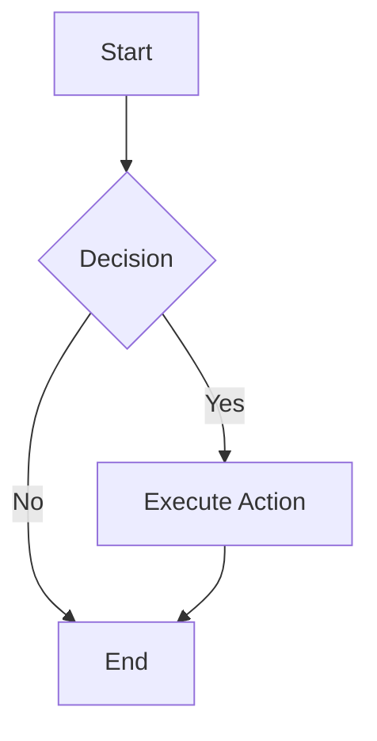
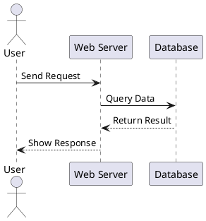

# Designdrawing Export Kit

**[English](README.en.md) | [中文](README.md)**

> **Local-first diagram rendering skills for Mermaid and PlantUML**

[](https://nodejs.org/)
[](LICENSE)

A local-first diagram rendering toolkit supporting **Mermaid** and **PlantUML** — the two mainstream diagram syntaxes — with **environment pre-flight checks, missing-dependency native dialogs, and one-click auto-installation**.

---

## Features

| Feature | mermaid-render | plantuml-render |
|---|---|---|
| Engine | Chromium + Puppeteer | Java + Graphviz |
| Output formats | SVG / PNG / PDF | PNG / SVG / PDF / EPS |
| Environment check | Auto-detects Node / npm / mmdc / browser | Auto-detects Java / Graphviz / plantuml.jar |
| Missing dependency prompt | Native Windows dialog (Yes/No) | Native Windows dialog (Yes/No) |
| Auto-installation | `npm install -g` | `winget install` + auto-download jar |
| Offline capable | Fully offline after browser setup | Fully offline after Java setup |

---

## Directory Structure

```
Designdrawing-Export-kit/
├── .claude-plugin/          # Claude plugin metadata
├── .codex-plugin/           # Codex plugin metadata
├── docs/
│   ├── images/              # Sample rendered diagrams
│   │   ├── mermaid-sample.svg
│   │   └── plantuml-sample.svg
│   └── diagram-rendering-guide.md
├── skills/
│   ├── mermaid-render/
│   │   ├── SKILL.md
│   │   ├── examples/
│   │   │   └── sample.mmd
│   │   └── scripts/
│   │       ├── commands/
│   │       │   ├── check.mjs
│   │       │   ├── fix.mjs
│   │       │   └── render.mjs
│   │       └── utils/
│   │           ├── browser-finder.mjs
│   │           ├── env-check.mjs
│   │           └── render.mjs
│   └── plantuml-render/
│       ├── SKILL.md
│       ├── examples/
│       │   └── sample.puml
│       └── scripts/
│           ├── commands/
│           │   ├── check.mjs
│           │   ├── fix.mjs
│           │   └── render.mjs
│           └── utils/
│               ├── plantuml-finder.mjs
│               ├── env-check.mjs
│               └── render.mjs
└── tools/                    # Shared tooling layer
    ├── bin/
    │   └── dde-tools.mjs    # Unified CLI entrypoint
    └── src/
        ├── commands/
        │   ├── install.mjs
        │   └── dialog-test.mjs
        └── utils/
            ├── dialogs.mjs
            ├── shell-runner.mjs
            ├── installer.mjs
            └── env-reporter.mjs
```

---

## Quick Start

### 1. Environment Check

```bash
# Mermaid
node skills/mermaid-render/scripts/mermaid-render.mjs --check

# PlantUML
node skills/plantuml-render/scripts/plantuml-render.mjs --check
```

Once the check passes, rendering is ready. If dependencies are missing, a native Windows dialog will ask whether to install them automatically:

```
+--------------------------------------------------+
| Install Missing Dependencies                      |
+--------------------------------------------------+
| Graphviz (dot) is missing.                       |
|                                                  |
| Would you like to install via winget?            |
+--------------------------------------------------+
| [  Yes(Y)  ]    [  No(N)  ]                      |
+--------------------------------------------------+
```

### 2. Render Diagrams

```bash
# Mermaid -> SVG
node skills/mermaid-render/scripts/mermaid-render.mjs \
  skills/mermaid-render/examples/sample.mmd \
  output.svg

# PlantUML -> SVG
node skills/plantuml-render/scripts/plantuml-render.mjs \
  skills/plantuml-render/examples/sample.puml \
  output.svg -t svg

# PlantUML -> PNG (default)
node skills/plantuml-render/scripts/plantuml-render.mjs \
  skills/plantuml-render/examples/sample.puml \
  output.png
```

### 3. Fix / Manual Installation

```bash
# Generate Puppeteer config only
node skills/mermaid-render/scripts/mermaid-render.mjs --fix

# Download plantuml.jar only
node skills/plantuml-render/scripts/plantuml-render.mjs --fix

# Install arbitrary dependencies via the tools layer
node tools/bin/dde-tools.mjs install npm:@mermaid-js/mermaid-cli
node tools/bin/dde-tools.mjs install winget:Graphviz.Graphviz
node tools/bin/dde-tools.mjs install jar:plantuml
```

---

## Sample Previews

### Mermaid Flowchart

**Source** (`skills/mermaid-render/examples/sample.mmd`):



**Rendered Output**:


---

### PlantUML Sequence Diagram

**Source** (`skills/plantuml-render/examples/sample.puml`):



**Rendered Output**:


---

## Tooling Layer (`tools/`)

`tools/` is the shared infrastructure across all skills to avoid code duplication:

| Tool | Purpose | Consumed By |
|---|---|---|
| `dialogs.mjs` | Native Windows Yes/No / Info dialogs | `check.mjs` |
| `shell-runner.mjs` | Command execution wrapper (sync/async) | `installer.mjs` |
| `installer.mjs` | `npm` / `winget` / `jar` installation | `check.mjs`, `dde-tools.mjs` |
| `env-reporter.mjs` | Unified environment report formatting | `check.mjs` |

---

## Requirements

### Mermaid

- Node.js >= 18
- npm (bundled with Node.js)
- Google Chrome / Microsoft Edge / Chromium
- `@mermaid-js/mermaid-cli` (globally or available via npx)

### PlantUML

- Node.js >= 18 (required by the wrapper CLI only)
- Java JRE >= 8
- Graphviz (optional but recommended; required for class/state/component diagrams)
- plantuml.jar (auto-downloaded via `--fix`)

---

## Plugin Support

- **Claude**: `.claude-plugin/plugin.json`
- **Codex**: `.codex-plugin/plugin.json`

Once installed, rendering skills can be triggered directly via conversation.

---

## License

MIT
