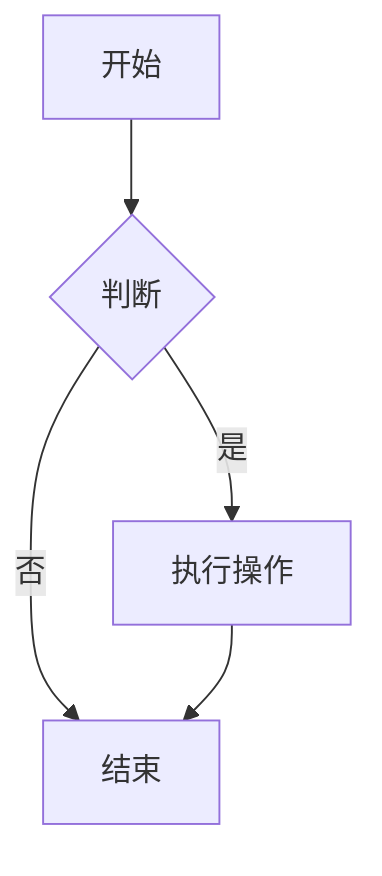
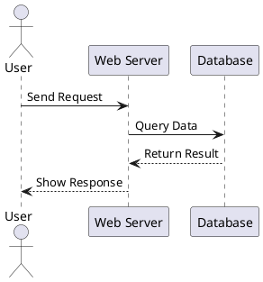
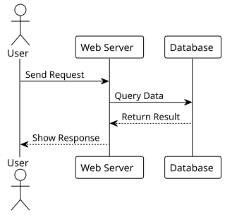

# Designdrawing Export Kit

> **面向本地工作环境的 Mermaid 与 PlantUML 图表渲染套件**

**[English](README.en.md) | [中文](README.md)**

[](https://nodejs.org/)
[](LICENSE)

一个面向本地工作环境的图表渲染工具套件，支持 **Mermaid** 和 **PlantUML** 两大主流图表语法，具备**环境预检、缺失依赖弹窗提示、一键自动安装**能力。

---

## 功能特性

| 特性 | mermaid-render | plantuml-render |
|---|---|---|
| 引擎 | Chromium + Puppeteer | Java + Graphviz |
| 输出格式 | SVG / PNG / PDF | PNG / SVG / PDF / EPS |
| 环境预检 | 自动检查 Node / npm / mmdc / 浏览器 | 自动检查 Java / Graphviz / plantuml.jar |
| 缺失依赖提示 | Windows 原生弹窗 (Yes/No) | Windows 原生弹窗 (Yes/No) |
| 自动安装 | `npm install -g` | `winget install` + 自动下载 jar |
| 离线可用 | 浏览器安装后完全离线 | Java 安装后完全离线 |

---

## 目录结构

```
Designdrawing-Export-kit/
├── .claude-plugin/          # Claude 插件元数据
├── .codex-plugin/           # Codex 插件元数据
├── docs/
│   ├── images/              # 示例渲染图
│   │   ├── mermaid-sample.svg
│   │   └── plantuml-sample.svg
│   └── diagram-rendering-guide.md
├── skills/
│   ├── mermaid-render/
│   │   ├── SKILL.md
│   │   ├── examples/
│   │   │   └── sample.mmd
│   │   └── scripts/
│   │       ├── commands/
│   │       │   ├── check.mjs
│   │       │   ├── fix.mjs
│   │       │   └── render.mjs
│   │       └── utils/
│   │           ├── browser-finder.mjs
│   │           ├── env-check.mjs
│   │           └── render.mjs
│   └── plantuml-render/
│       ├── SKILL.md
│       ├── examples/
│       │   └── sample.puml
│       └── scripts/
│           ├── commands/
│           │   ├── check.mjs
│           │   ├── fix.mjs
│           │   └── render.mjs
│           └── utils/
│               ├── plantuml-finder.mjs
│               ├── env-check.mjs
│               └── render.mjs
└── tools/                    # 共享工具层
    ├── bin/
    │   └── dde-tools.mjs    # 统一 CLI 入口
    └── src/
        ├── commands/
        │   ├── install.mjs
        │   └── dialog-test.mjs
        └── utils/
            ├── dialogs.mjs
            ├── shell-runner.mjs
            ├── installer.mjs
            └── env-reporter.mjs
```

---

## 快速开始

### 1. 环境检查

```bash
# Mermaid
node skills/mermaid-render/scripts/mermaid-render.mjs --check

# PlantUML
node skills/plantuml-render/scripts/plantuml-render.mjs --check
```

检查通过后可直接渲染。若缺失依赖，会弹出 Windows 原生对话框询问是否自动安装：

```
+--------------------------------------------------+
| 安装缺失依赖                                      |
+--------------------------------------------------+
| 检测到缺少 Graphviz (dot)。                      |
|                                                  |
| 是否通过 winget 自动安装？                      |
+--------------------------------------------------+
| [  是(Y)  ]    [  否(N)  ]                      |
+--------------------------------------------------+
```

### 2. 渲染图表

```bash
# Mermaid -> SVG
node skills/mermaid-render/scripts/mermaid-render.mjs \
  skills/mermaid-render/examples/sample.mmd \
  output.svg

# PlantUML -> SVG
node skills/plantuml-render/scripts/plantuml-render.mjs \
  skills/plantuml-render/examples/sample.puml \
  output.svg -t svg

# PlantUML -> PNG (默认)
node skills/plantuml-render/scripts/plantuml-render.mjs \
  skills/plantuml-render/examples/sample.puml \
  output.png
```

### 3. 修复 / 手动安装

```bash
# 仅生成 Puppeteer 配置文件
node skills/mermaid-render/scripts/mermaid-render.mjs --fix

# 仅下载 plantuml.jar
node skills/plantuml-render/scripts/plantuml-render.mjs --fix

# 通过 tools 层安装任意依赖
node tools/bin/dde-tools.mjs install npm:@mermaid-js/mermaid-cli
node tools/bin/dde-tools.mjs install winget:Graphviz.Graphviz
node tools/bin/dde-tools.mjs install jar:plantuml
```

---

## 示例预览

### Mermaid 流程图

**源码** (`skills/mermaid-render/examples/sample.mmd`):



**渲染结果**:



---

### PlantUML 时序图

**源码** (`skills/plantuml-render/examples/sample.puml`):



**渲染结果**:



---

## 工具层 (`tools/`)

`tools/` 是所有 skill 的共享基础设施，避免重复代码：

| 工具 | 功能 | 被使用 |
|---|---|---|
| `dialogs.mjs` | Windows 原生 Yes/No / Info 弹窗 | `check.mjs` |
| `shell-runner.mjs` | 命令执行封装 (sync/async) | `installer.mjs` |
| `installer.mjs` | `npm` / `winget` / `jar` 安装 | `check.mjs`, `dde-tools.mjs` |
| `env-reporter.mjs` | 统一格式化环境报告 | `check.mjs` |

---

## 环境要求

### Mermaid

- Node.js >= 18
- npm (随 Node.js 附带)
- Google Chrome / Microsoft Edge / Chromium
- `@mermaid-js/mermaid-cli` (全局或 npx 可用)

### PlantUML

- Node.js >= 18 (仅 wrapper CLI 需要)
- Java JRE >= 8
- Graphviz (可选但推荐，类图/状态图/组件图必需)
- plantuml.jar (`--fix` 自动下载)

---

## 插件支持

- **Claude**: `.claude-plugin/plugin.json`
- **Codex**: `.codex-plugin/plugin.json`

安装后可直接通过对话触发渲染 skill。

---

## License

MIT
